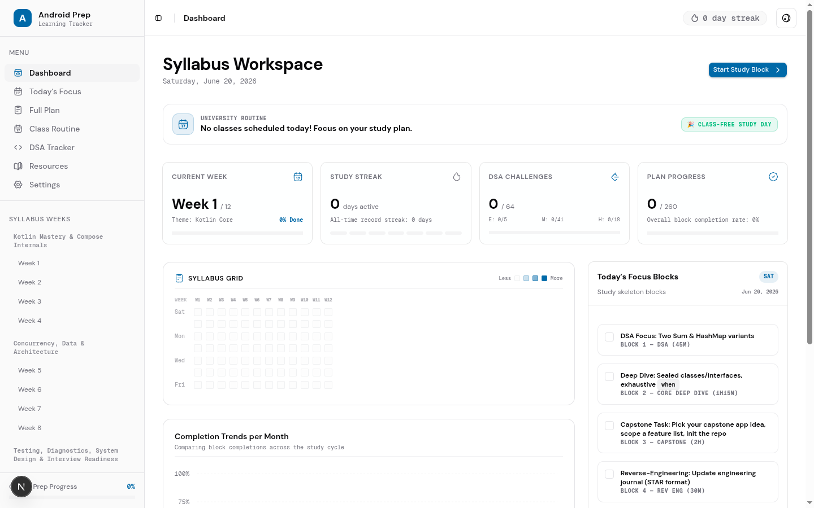
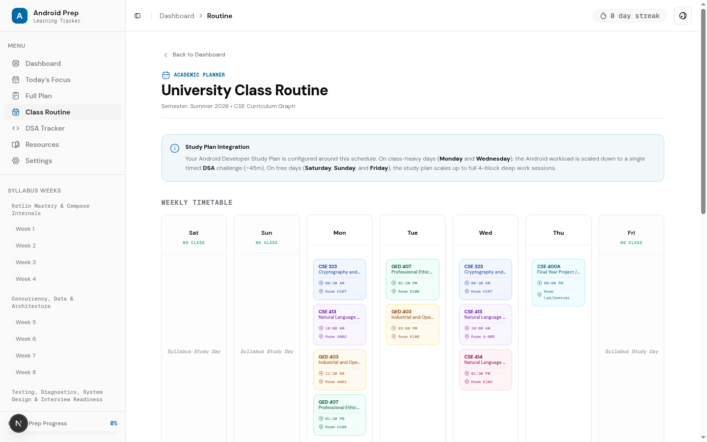
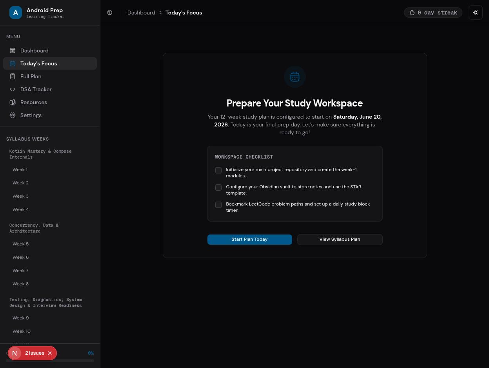
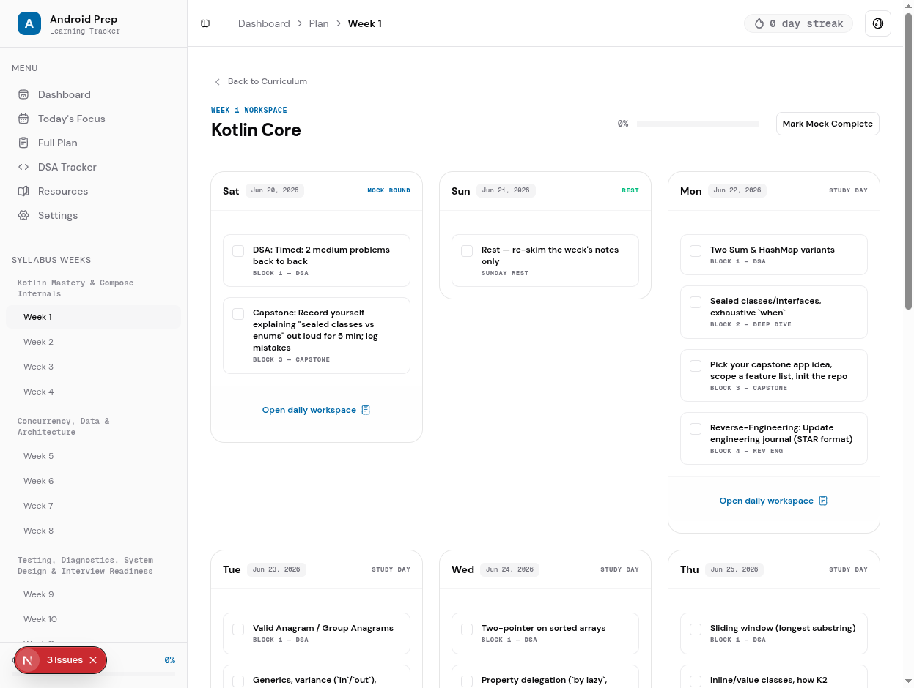
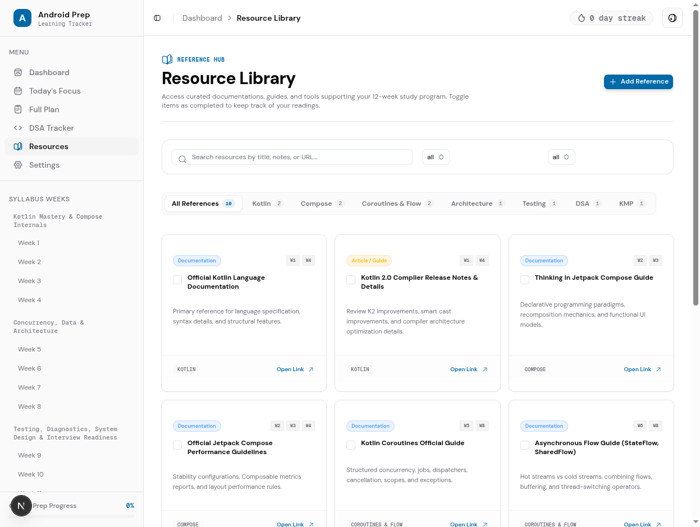
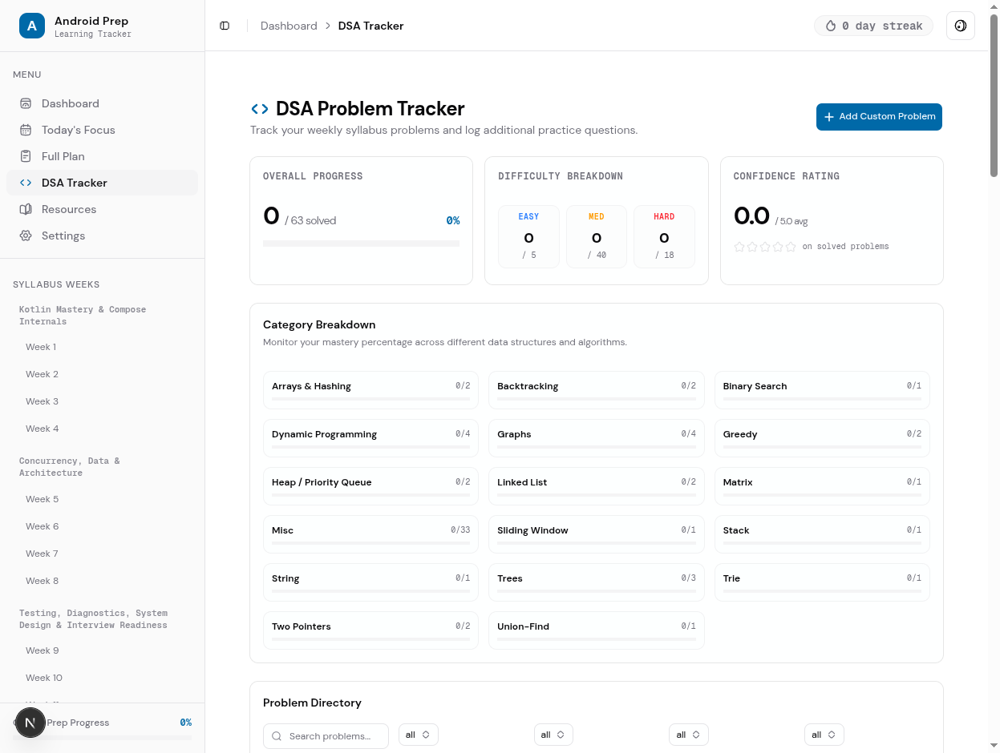

# Android Prep — Learning Tracker

An interactive study planner and diagnostics dashboard for the **12-Week Android Developer Interview Prep Plan**, built in collaboration with **Antigravity** (Google DeepMind's agentic AI coding assistant).

---

## 🚀 Key Features

* **Interactive Curriculum Roadmap**: Dynamic syllabus layout with month-by-month collapsible week accordions and progress tracking.
* **Daily Focus Workspace**: Obsidian STAR journal reflection generator, weekend whiteboard checklist, and integrated timer support.
* **Global Pomodoro Focus Timer**: Persisted countdown timer ticking down in the header context across route changes, featuring background tab calculations and completion toasts.
* **DSA Problem Tracker**: Filterable directory to log solved DSA patterns, difficulty ranks, and review confidence levels.
* **Resource Library**: Category-grouped external references directory supporting custom entries and multi-week syllabus tagging.
* **Settings & Backup**: Toggle themes (Light/Dark/System), configure daily study targets, adjust start dates (shifting calendar dates dynamically), and export/import state backups via JSON.

---

## 🛠️ Technology Stack

* **Core**: Next.js 15+ (App Router), React 19, TypeScript
* **Styling**: Tailwind CSS v4, shadcn/ui components
* **Icons**: Hugeicons React
* **Charts**: Recharts
* **State Management**: React `useReducer` and React Context Provider, automatically persisted to `localStorage`

---

## 📸 Screenshots

### Dashboard


### Class Routine


### Today's Focus


### Weekly Plan


### Resource Library


### DSA Tracker


---

## ⚡ Getting Started

```bash
# Clone the repository
git clone https://github.com/itshimelz/learning-tracker.git
cd learning-tracker

# Install dependencies
pnpm install

# Run the development server
pnpm dev
```

Open [http://localhost:3000](http://localhost:3000) to view the app.

---

## 🤖 Built with Antigravity

This application was engineered through an autonomous, step-by-step pair-programming pipeline with **Antigravity** (Google DeepMind's agentic AI coding assistant):
1. **Curriculum Parsing**: Extracted and parsed structured raw markdown study syllabi into type-safe JSON templates.
2. **State Design**: Established a custom local storage sync schema for tracking problems, study tasks, resources, and dates.
3. **Responsive UI & Polish**: Applied premium glassmorphism accents, transitions, and layout refinements for mobile-friendly viewports.
4. **Global Timer State**: Transitioned active session timers to a layout-level hook to support tab restarts and navigation stability.
5. **Autotagging**: Designed tagging mechanisms to serve topic-specific articles/docs directly inside target study cards.
